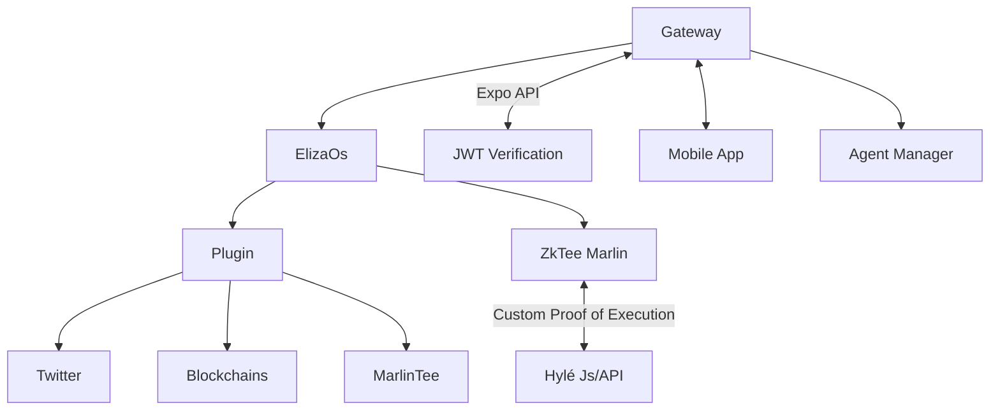

# Plethora: Verifiable custom AI agent

## Overview

Plethora is a cutting-edge tool designed for creating and deploying custom AI agents with a focus on verifiability and data privacy. By leveraging Zero-Knowledge Proofs (ZKPs), Plethora ensures that each task performed by an AI agent is validated securely and efficiently without revealing sensitive data. This innovative approach allows AI agents to demonstrate task completion without disclosing the underlying details, maintaining data privacy and integrity.


## Features

- **Zero-Knowledge Proofs**: Ensure data privacy and security by allowing AI agents to prove task completion without revealing sensitive information.
- **Verifiable AI Agents**: Create custom AI agents whose tasks can be verified securely using ZKPs running in zkTEE using __Marlin Oyster__.
- **Efficient Validation**: Streamline the validation process for AI tasks, ensuring efficiency and reliability.
- **Data Privacy**: Maintain data privacy by keeping sensitive information confidential during the proof generation and verification process.
- **Scalability**: Designed to handle increasing loads and data, ensuring performance and reliability.

## Installation

### Prerequisites

- Node.js (version 14 or later)
- npm (version 6 or later) or Yarn
- Expo CLI (for mobile app development)

### Steps

1. **Clone the Repository**

   ```bash
   git clone https://github.com/Magicred-1/zkP-AI.git
   cd zkP-AI
   ```

2. **Install Dependencies**

   ```bash
   npm install
   # or
   yarn install
   ```

3. **Set Up Environment Variables**

   Create a `.env` file in the root directory and add the necessary environment variables:

   ```
   ELIZA_OS_API_KEY=your_eliza_os_api_key
   ZKP_SERVER_URL=your_zkp_server_url
   ```

## Usage

### Running the Mobile App

1. **Start the Expo Development Server**

   ```bash
   npm start
   # or
   yarn start
   ```

2. **Run on an Emulator or Physical Device**

   - Use the Expo Go app on your mobile device to scan the QR code displayed in the terminal.
   - Alternatively, run on an Android emulator or iOS simulator.

### Interacting with AI Agents

- The mobile app provides an interface to interact with custom AI agents.
- Users can input queries, and the agents will respond with intelligent and context-aware answers.

### Zero-Knowledge Proofs

- The app integrates ZKPs to ensure that AI task data remains private and secure.
- AI agents can prove task completion without revealing sensitive information, and verifiers can confirm the task's authenticity using the proof.

## Architecture

- **Frontend**: Built with React Native and Expo, providing a cross-platform mobile application.
- **Backend**: Utilizes custom AI agents for task execution and a separate server for handling ZKP operations.
- **Security**: Implements ZKPs to ensure data privacy and integrity.


## Contributing

Contributions are welcome! Please follow these steps:

1. Fork the repository.
2. Create a new branch (`git checkout -b feature-branch`).
3. Commit your changes (`git commit -am 'Add new feature'`).
4. Push to the branch (`git push origin feature-branch`).
5. Create a new Pull Request.

## License

This project is licensed under the MIT License. See the [LICENSE](LICENSE) file for details.

## Acknowledgments

- Thanks to the Eliza OS team for providing the AI agent.
- Inspiration and support from the open-source community.

## Contact

For any questions or support, please open an issue on the GitHub repository.
[Charles-André](https://www.linkedin.com/in/charles-andr%C3%A9-goichot/)
[Djason](https://www.linkedin.com/in/djason-gadiou/)
